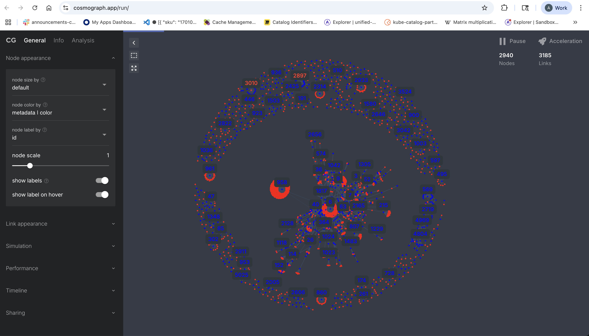
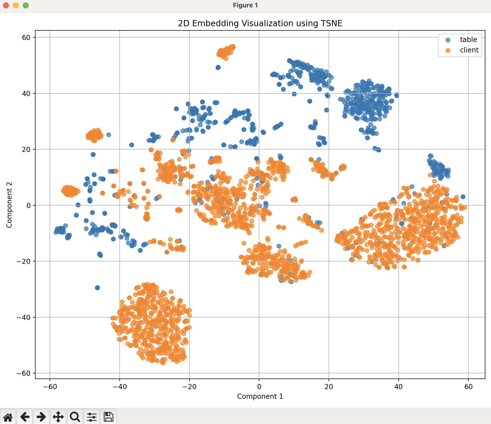
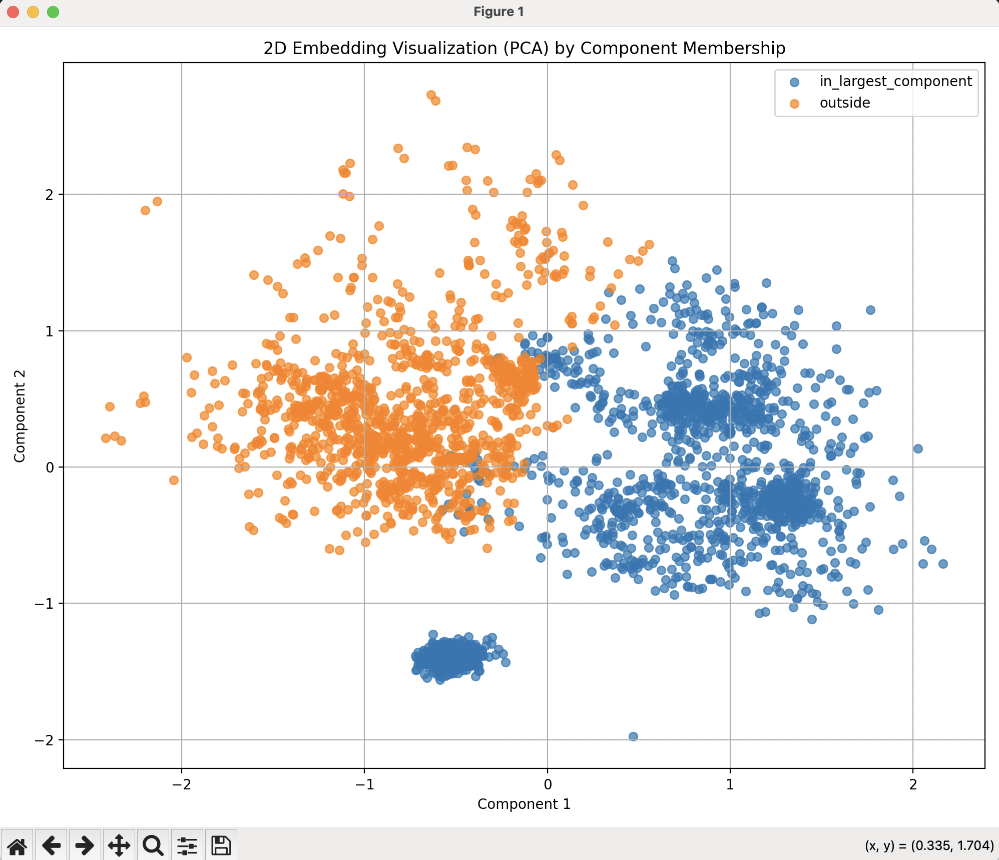
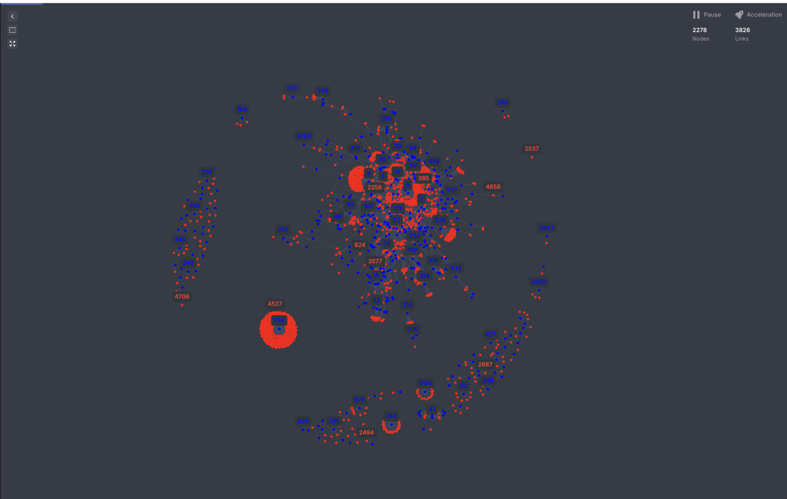
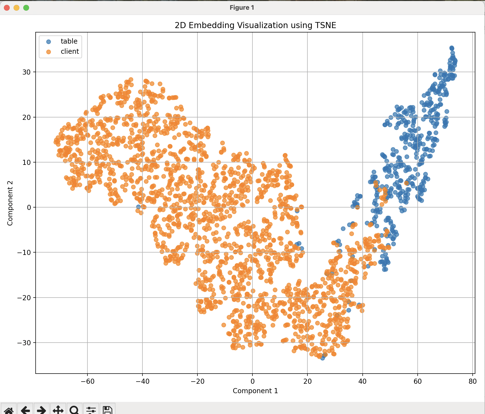
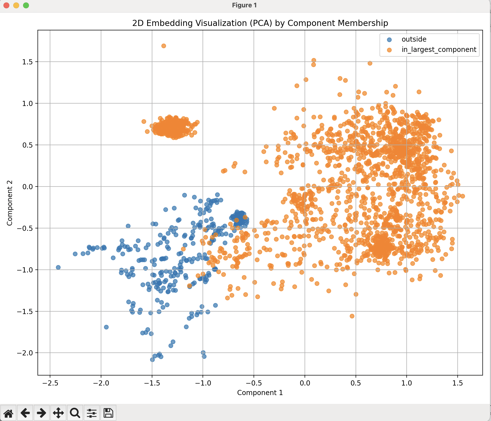

# Quick Start
https://packaging.python.org/en/latest/guides/installing-using-pip-and-virtual-environments/ 

`sudo sh pipeline.sh [file].csv`

# Introduction

This project demonstrates that embedding algorithms are able to encode properties of large real-world graphs. 

Embeddings are important because data is typically embedded (aka. mapped to a vector space) before being used as an input in ML models, such as LLMs.

ML algorthims can be helpful when the scale makes visualizing and reasoning about the graph difficult.

The data for this project is a month's log of SQL queries against an MSSQL server, about 20K queries (after deduplication).

# Requirements:

Given a log of SQL queries: 
1. Build a graph of relationships between clients and tables using FROM and JOIN clauses. 
2. Embed the graph using the node2vec algorithm.
3. Visualize the embeddings against known labels, for example:
	- Client or Table.
	- Inside or Outside the largest connected component.

# Implementation:

Two possible strategies for graph-building resulted in largely the same outcome:
1. JOINs connect Clients to Tables.
2. FROMS connect Clients to Tables, and JOINS connect Tables to Tables.
	
	
The known labels are:
1. Inside or Outisde the largest connected component.
2. Client or Table.

These two labels were determined by the observing two properties the graphs in cosmograph:
1. That there was one very large connected component, and many small ones.
2. That there were relatively equal number of clients and tables (but more clients overall).

One additional note is that directed Node2Vec worked better for Clients/Table label for while undirected node2vec worked better for the Connected Component feature. This is because (in theory), undirected sampling better captures homophily, and directed samples better captures structural equivalance. 

Some possible reasons for this are: 

For example, all clients have no parents in that directed model, that is an important structural equivalence. Conversely, membership in largest connected component is better understood by homophily, which is easier to capture by allowing more randomness in the sampling (ie. ignoring directedness), so that samples can better traverse the largest connected component. 

# Input:
A csv of sql_hashes and queries, taken from solrwind db analyzer. Roughly 20K queries (before deduplication).

# Results:

The main result is the ability to easily divide the nodes according to known labels using a straight or curved line. This suggests that the embedding algorithm successfully embedded the respective property of the graph into vector space, and therefore could be useful in future model building.

# Examples:

## Tables to Tables:

### (using cosmograph)

### Visualization of Client vs Tables: 
(tables to tables)
 

### Visualization of Inside vs Outside Largest Connect Component (tables to tables strategy):

## Clients to Tables 

### (using cosmograph):

### Visualization of Client vs Tables (client to tables strategy):

 

### Visualization of Inside vs Outside Largest Connect Component 
(clients to tables strategy):

# Discussion:

There are information trade-offs associated with each graph-building method. As mentioned, there are two ways to parse the SQL logs and build the graph. The first way is to connect Clients to Tables regardless of purpose (FROM, JOIN etc), while the second way is the connect Clients to the FROM Tables and link Tables to Tables according to JOINs.

One trade-off is the separability of the tables' purpose. For example, the Client-to-Table graph sacrifices JOIN paths because clients map to all tables irrespective of purpose. One solution could be metadata on the edges, but even then, the actual join path would still be missing. This is an acceptable loss for information because if the goal is to delete dependencies, so it would be ok to remove one table at a time in the query. Also, the resulting graph is greatly simplified to essentially a mapping from spaces C -> T, rather than a graph.

Another trade-off is the separability of the queries. For example, in the Table-to-Tables graph, the sacrifice is query isolation because multiple queries might traverse the same join path, and the edges would not distinguish between the queries. This is acceptable if the goal is to determine the true dependencies between tables, where even though there is FK graph, the real dependencies are revealed operationally though JOINS. One way to retain the query distinguishability could be weighted or duplicated edges, but this could also pollute the graph.
